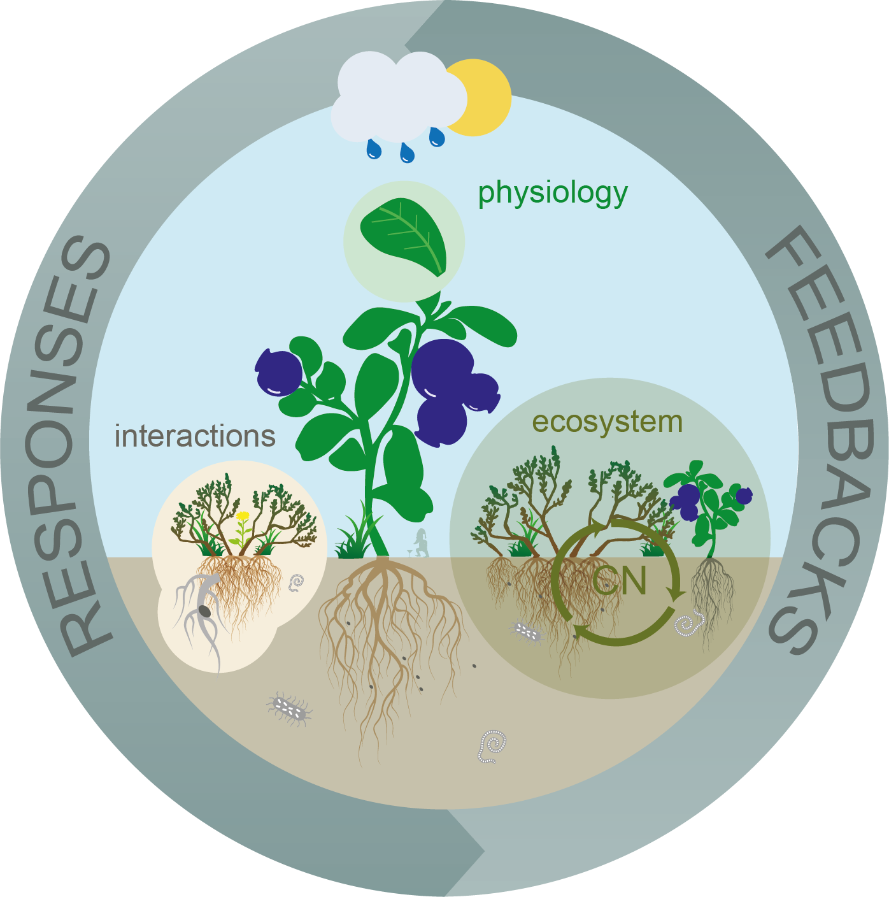
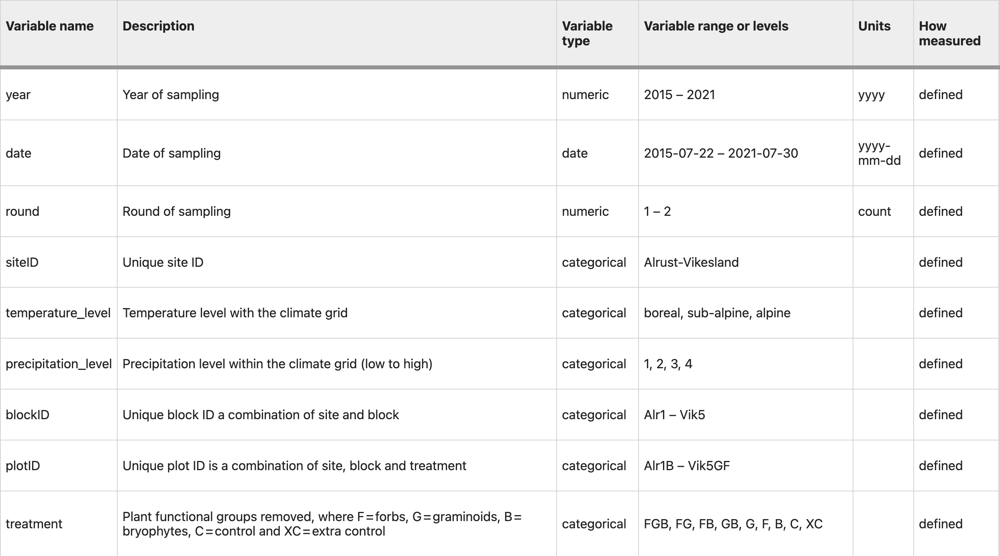

This is the git repository for the [DURIN
project](https://betweenthefjords.w.uib.no/durin/). The goal of this
repo is to organize and streamline the data management in the project
and beyond.



## DATA MANAGEMENT

### Location of data, metadata and code

The overview of all the **datasets** is
[here](https://docs.google.com/spreadsheets/d/1KlQwSkcPa09POOSV0B7i_Z5KWcKDyw_Xu7Jikc9voyA/edit?usp=sharing).

The raw and clean **datasets** from are stored and will be made
available after the end of the project on [OSF](https://osf.io/f4v9t/).
For now the data is only available to the project partners.

All R code for the cleaning the raw data is available on the [Durin
GitHub](https://github.com/Durin-project). Particularly, look for the `clean_trait_data.R` script if you just want to clean the raw data. If you want to look for errors in the data, use the `check_traits > how to clean trait data.R` script.

The data documentation, including a draft for the data paper is
available
[here](https://docs.google.com/document/d/13Mky4gZfCzHIZl82zQKX6nb2vRneZXDRVDAmp0a3gdA/edit?usp=sharing)
(only available for authors), and the **data dictionaries** are in this
below in this readme file.

### Naming conventions for the data and files

We use **snake_case style** for names and coding. Snake_case means that
we use lower case letters separated by an underscore, for example
*biomass_g*.

File and variable names should be *meaningful*. Do not use *my_data.csv*
or *var1*. For a full description of the main variables see table below.

We use some **redundancy** in variable names to avoid mistakes. BlockID
and plotID should contain the higher hierarchical levels. For example
blockID is a combination of siteID + block number: Lyg1, Lyg2. PlotID
contains siteID, block number and treatment: Lyg1_open, Lyg1_forest

| Files or variable  | Naming convention                                                                                      | Example                                                           |
|:-------------------|:-------------------------------------------------------------------------------------------------------|:------------------------------------------------------------------|
| Project            | Project name                                                                                           | DURIN                                                             |
| Datasets           | Project_Status\_(Experiment)\_Response_Year(s).Extension                                               | DURIN_clean_cflux_2023-2025.csv                                   |
|                    |                                                                                                        |                                                                   |
| date               | Date of data collection                                                                                | yyyy-mm-dd; do not split year, month and day into several columns |
| year               | Year of data collection                                                                                | yyyy; allowed if no specific date is available, try to avoid      |
| site_ID_name       | Unique site name written out fully                                                                     | Lygra, Sogndal, Senja, Kautokeino and Tjotta                      |
| siteID             | Unique site ID, first 2 letters of site name.                                                          | LY, SO, SE, and KA, TJ                                            |
| blockID            | Does this exist?                                                                                       | LY1                                                               |
| habitat            | Open versus forested habitat                                                                           | O, F                                                              |
| successional_stage | Vegetation representing post-fire successional stages.                                                 | young, intermediate, old                                          |
| drought            | Drought treatment using rain-out shelters that reduce precipitation by 0, 60 or 90%.                   | ambient, moderate, extreme                                        |
| plot_nr            | Unique plot number, numeric value from 1-5.                                                            | 1-5                                                               |
| plotID             | Unique plot ID as a combination of siteID, habitat and plot number                                     | LY_O\_1, LY_F\_1                                                  |
| species            | Vascular plant taxon names follow for Norway Lid & Lid (Lid J & Lid, 2010). We use full species names. | *Leontopodium nivale*                                             |
| responses          | Response variables                                                                                     | cover, biomass, Reco                                              |

### Organize data sets

Sort the dataset so that the important variable come first, preferable
use this order:

- Date/year
- siteID
- blockID
- plotID
- habitat
- treatment
- plantID
- leafID
- response_variable (diversity, biomass, flux)
- predictor_variables (temperature level, oceanity)
- other_variables (remark, data collector, weather)

### Data dictionary

**How to make a data dictionary?**

The R package **dataDocumentation** that will help you to make the data
dictionary. You can install and load the package as follows:

``` r

# if needed install the remotes package
install.packages("remotes")

# then install the dataDocumentation package
remotes::install_github("audhalbritter/dataDocumentation")

# and load it
library(dataDocumentation)
```

*Make data description table*

Find the file *R/data_dic/data_description.xlsx*. Enter all the
variables into that table, including variable name, description,
unit/treatment level and how measured. If the variables are global for
all of Funder, leave TableID blank (e.g. siteID). If the variable is
unique for a specific dataset, create a TableID and use it consistently
for one specific dataset. Make sure you have described all variables.

*Make data dictionary*

Then run the function make_data_dic().

``` r

data_dic <- make_data_dictionary(data = biomass,
                                 description_table = description_table,
                                 table_ID = "biomass",
                                 keep_table_ID = FALSE)
```

Check that the function produces the correct data dictionary.

*Add data dictionary to readme file*

Finally, add the data dictionary below to be displayed in this readme
file. Add a title, and a code chunk using `kable()` to display the data
dictionary.

For more details go to the [dataDocumentation
readme](https://github.com/audhalbritter/dataDocumentation) file.


